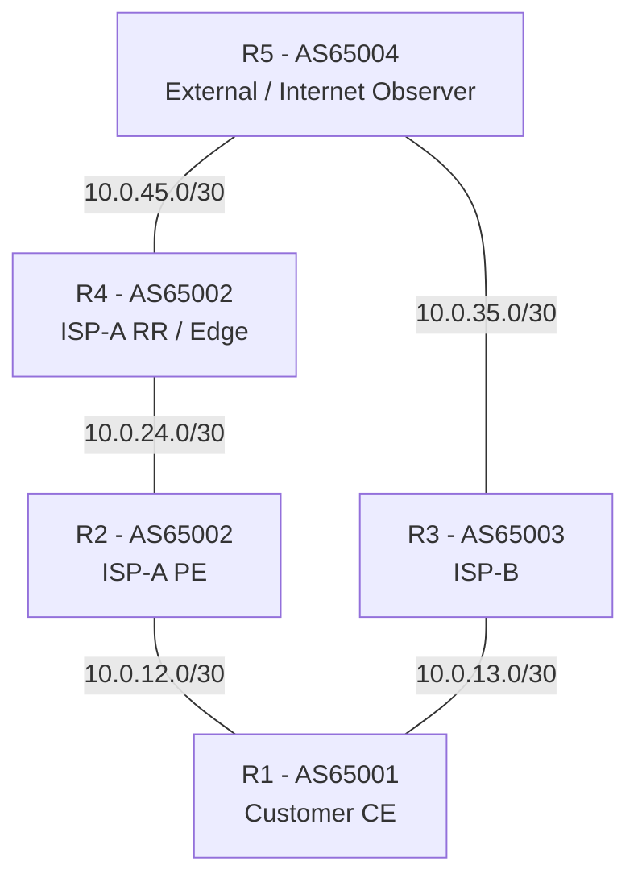

# Cisco BGP Job-Ready Lab

A multi-AS Cisco IOS-XE lab focused on production-style BGP engineering and troubleshooting. The lab covers customer/ISP edge routing, iBGP route reflection, path selection, policy control, dual-upstream traffic engineering, route-leak protection, maximum-prefix protection, and remotely triggered black hole (RTBH) routing.

## Topology



## What I Practised

- eBGP and iBGP session establishment and FSM troubleshooting
- BGP table vs global RIB vs CEF/FIB
- AS_PATH loop prevention and path selection
- NEXT_HOP reachability and `next-hop-self`
- iBGP full mesh and Route Reflector behaviour
- Weight, LOCAL_PREF, MED, Origin and eBGP-vs-iBGP preference
- Prefix-lists and route-maps for customer route validation
- BGP communities for tagging and policy execution
- Maximum-prefix protection and recovery from `Idle (PfxCt)`
- Route aggregation and `summary-only`
- Default route advertisement
- Dual-upstream outbound traffic engineering using LOCAL_PREF
- Dual-upstream inbound traffic engineering using AS-PATH prepending
- Route-leak prevention using strict customer export filters
- Customer-triggered RTBH using a dedicated BGP community
- RIB failure caused by a lower administrative-distance route
- Policy troubleshooting across CE outbound and PE inbound layers

## Production Troubleshooting Workflow

```text
Session
  -> Prefix originated?
  -> Advertised?
  -> Received / accepted?
  -> NEXT_HOP reachable?
  -> Valid?
  -> Best?
  -> Installed in RIB?
  -> Installed in CEF/FIB?
  -> Return path working?
```

## Key Scenarios

### Dual-Upstream Outbound TE

R1 receives the same Internet test prefix from ISP-A and ISP-B. LOCAL_PREF is set to prefer ISP-A while keeping ISP-B as backup.

```text
ISP-A / AS65002 -> LOCAL_PREF 200
ISP-B / AS65003 -> LOCAL_PREF 100
```

The lab validated primary-path selection, failover after ISP-A loss, and automatic failback after recovery.

### Dual-Upstream Inbound TE

R1 advertises its customer prefix to both providers. AS-PATH prepending is applied only toward ISP-B so an external AS prefers ISP-A.

```text
ISP-A path: 65002 65001
ISP-B path: 65003 65001 65001 65001
```

### RTBH

A customer advertises an attacked /32 with community `65002:666`. ISP-A validates the trigger, rewrites the next hop to a discard address, adds `no-export`, and propagates the blackhole route internally.

CEF verification proved the route resolved recursively to Null0:

```text
192.0.2.99/32
  recursive via 192.0.2.254
    attached to Null0
```

## Useful Commands

```text
show ip bgp summary
show ip bgp <prefix>
show ip bgp neighbors <peer> routes
show ip bgp neighbors <peer> advertised-routes
show ip prefix-list
show route-map
show ip route <destination>
show ip route <next-hop>
show ip cef <destination> detail
clear ip bgp <peer> soft in
clear ip bgp <peer> soft out
```

## Important Lessons

- BGP session up does not mean the required prefix exists.
- A BGP route can exist but be unusable because its next hop is unreachable.
- BGP best path selection happens before global RIB administrative-distance comparison.
- `r>` means the path is BGP best but suffered a RIB failure.
- A route permitted by one policy can still be denied by another policy layer.
- AS-PATH prepending influences inbound routing but does not guarantee the remote path decision.
- Customer CE devices should explicitly restrict what they are allowed to export to each upstream.

## Repository Structure

```text
.
├── README.md
├── docs/
│   ├── FINAL_TECHNICAL_SUMMARY.md
│   └── TROUBLESHOOTING_PLAYBOOK.md
└── configs/
    ├── README.md
    ├── R1_customer_ce.cfg
    ├── R2_isp_a_pe.cfg
    ├── R3_isp_b.cfg
    ├── R4_isp_a_rr_edge.cfg
    └── R5_external_as.cfg
```

> The configuration files are cleaned reference configurations derived from the lab. They intentionally omit unrelated default IOS-XE boilerplate and platform-specific certificate/HTTP configuration.
