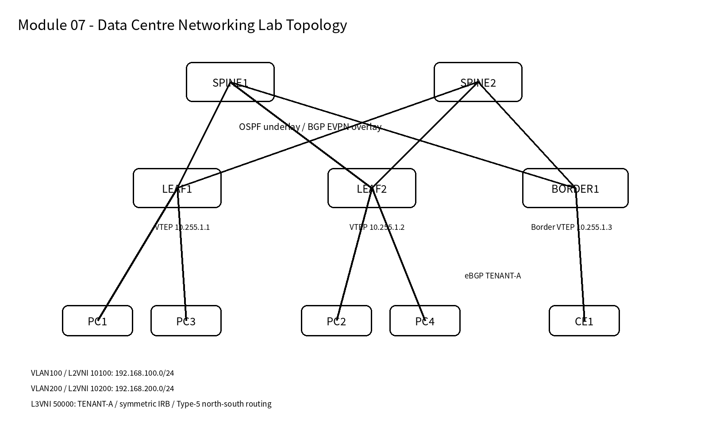

# Module 07 - Data Centre Networking: VXLAN EVPN, Nexus Operations and Failure Engineering

**Status:** Completed  
**Primary production mapping:** Cisco Nexus / NX-OS  
**Hands-on implementation:** FRRouting 10.3 + Linux VXLAN/bridge in GNS3  
**Scope:** Nexus vPC reference, routed spine-leaf underlay, BGP EVPN overlay, L2VNI/L3VNI, distributed anycast gateway, symmetric IRB, EVPN Type-2/3/5, Border Leaf, north-south routing, DCI design, failure engineering, and Nexus operational troubleshooting.

## Why this module matters

The goal was not to reproduce a vendor exam. The lab was built around the operational patterns expected in enterprise and managed data-centre networks: redundant Clos underlay, EVPN control plane, VXLAN data plane, tenant segmentation, local distributed gateways, controlled external route exchange, and fault isolation.

## Topology



Core addressing:

| Role | Address / VNI |
|---|---|
| SPINE1 Loopback | 10.255.0.1/32 |
| SPINE2 Loopback | 10.255.0.2/32 |
| LEAF1 VTEP | 10.255.1.1/32 |
| LEAF2 VTEP | 10.255.1.2/32 |
| BORDER1 VTEP | 10.255.1.3/32 |
| VLAN100 | 192.168.100.0/24 -> L2VNI 10100 |
| VLAN200 | 192.168.200.0/24 -> L2VNI 10200 |
| TENANT-A | L3VNI 50000 |
| External CE | 172.31.0.0/31, AS65100 |
| External test prefix | 203.0.113.0/24 |

## Architecture learned

```text
Underlay IP reachability (OSPF)
        ↓
VTEP loopback reachability
        ↓
BGP EVPN control plane
        ↓
VXLAN data plane
        ↓
L2VNI for broadcast domains
        ↓
VRF + L3VNI for tenant routing
        ↓
Distributed anycast gateway / symmetric IRB
        ↓
Border Leaf / Type-5 / north-south routing
```

## Verified hands-on outcomes

- OSPF ECMP across dual spines; single uplink failure removed one path while traffic survived.
- Dual EVPN route reflectors; loss of one RR session did not interrupt forwarding.
- VXLAN L2VNI 10100 with Type-3 IMET and Type-2 MAC/IP learning.
- Packet capture proved outer VTEP-to-VTEP UDP/4789 and correct VNI.
- L3VNI 50000 with TENANT-A, distributed anycast gateways and symmetric IRB.
- Packet capture proved routed east-west traffic used VNI 50000 and leaf router MACs.
- Type-5 prefix advertisement for 10.10.50.0/24 and external 203.0.113.0/24/default route.
- Border Leaf eBGP to CE with explicit inbound/outbound policies under RFC 8212 behavior.
- North-south traffic was VXLAN inside the fabric and plain IP on the Border-to-CE link.
- RT mismatch fault: Type-5 remained visible in EVPN BGP table while the prefix disappeared from TENANT-A RIB.
- MTU fault: small/medium traffic could pass while a 1500-byte inner DF packet black-holed when the only fabric path had MTU 1500.

## EVPN route types used

| Type | Practical purpose in this module |
|---|---|
| Type-2 | Host MAC / MAC+IP location |
| Type-3 | IMET membership and BUM replication |
| Type-5 | IP prefix advertisement between tenant VRFs / Border Leaf |
| Type-1 / Type-4 | Reviewed conceptually for EVPN multihoming / ESI; not the focus of this lab |

## FRR/Linux to Cisco Nexus mapping

| Lab implementation | Cisco Nexus / NX-OS production concept |
|---|---|
| Linux `br100` / `br200` | VLAN 100 / VLAN 200 |
| Linux `vxlan10100` | `interface nve1` member VNI 10100 |
| VTEP loopback | `nve1 source-interface loopback0` |
| `nolearning` + FRR EVPN | `host-reachability protocol bgp` |
| `br50000` + VRF TENANT-A | VRF TENANT-A + L3VNI 50000 |
| Linux bridge gateway IP/MAC | SVI + `fabric forwarding mode anycast-gateway` |
| FRR Type-5 export | NX-OS `advertise l2vpn evpn` under VRF IPv4 AF |

**Important implementation difference:** the lab used Linux bridge MACs to emulate anycast gateway behavior. On Nexus, a fabric-wide anycast gateway MAC is normally configured and reused across participating VTEPs.

## Troubleshooting hierarchy

1. Physical interface / MTU
2. Underlay routing and VTEP loopback reachability
3. BGP EVPN session / RR health
4. NVE peer and VNI state
5. VRF / RD / RT / VLAN-VNI mapping
6. EVPN Type-2 / Type-3 / Type-5 presence
7. RIB/FIB, MAC, ARP/ND and L2RIB programming
8. Packet capture to validate outer VTEP, UDP 4789, VNI and inner headers

See `docs/` for detailed verification, failure testing, Cisco operational mapping, rollback, and incident notes.

## Platform notes

Round 1 Nexus vPC was maintained as **Cisco NX-OS reference configuration / expected operational output**, not falsely claimed as a hands-on N9Kv lab. The free Cisco DevNet/CML environment used during the project could not reliably boot N9Kv, so the remainder was implemented with FRR/Linux and explicitly mapped to Nexus.

## Portfolio evidence

- `configs/frr/` - verified/reconstructed FRR control-plane configuration fragments
- `configs/linux/` - Linux dataplane reconstruction scripts and addressing notes
- `configs/nxos-reference/` - production-reference NX-OS snippets
- `docs/verification-cheatsheet.md`
- `docs/failure-testing.md`
- `docs/troubleshooting.md`
- `docs/cisco-nxos-production-mapping.md`
- `docs/change-plan-rollback.md`
- `docs/incident-rca.md`
- `docs/platform-ecosystem.md`

> Configuration files are intentionally labelled where they are reconstructed from the verified lab state rather than copied from a final `show running-config` snapshot.
