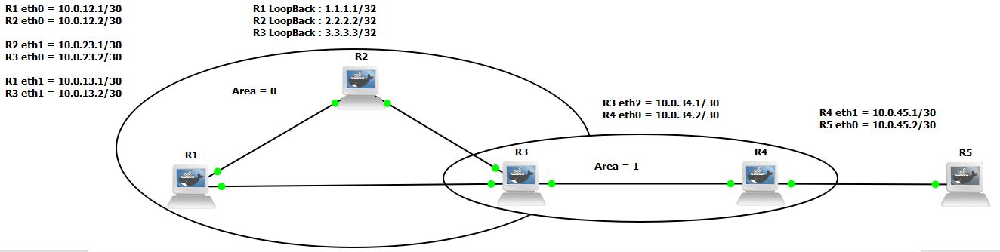

# Multi-Area OSPF Engineering Lab (GNS3 / FRR 10.3)

## Overview

This repository documents a five-router multi-area OSPF engineering lab built in GNS3 using FRR 10.3. The work focused on protocol behavior, design boundaries, route propagation, fault injection, troubleshooting, recovery, and final-state validation rather than basic adjacency bring-up.

The final topology includes:

- a redundant **Area 0** core (R1/R2/R3)
- **R3 as ABR** between Area 0 and Area 1
- **Area 1 as Totally NSSA**
- **R4 as an NSSA ASBR**
- **R5 as an external non-OSPF router**
- inter-area and external route summarization
- E1/E2 redistribution
- MD5 authentication
- passive-interface advertisement
- deliberate break/fix scenarios



## Topology and Addressing

| Router | Interface | Address | Role |
|---|---|---:|---|
| R1 | eth0 | 10.0.12.1/30 | Area 0 P2P to R2 |
| R1 | eth1 | 10.0.13.1/30 | Area 0 P2P to R3, cost 30 |
| R1 | lo | 1.1.1.1/32 | Router ID / loopback |
| R2 | eth0 | 10.0.12.2/30 | Area 0 P2P to R1 |
| R2 | eth1 | 10.0.23.1/30 | Area 0 broadcast segment to R3 |
| R2 | lo | 2.2.2.2/32 | Router ID / loopback |
| R3 | eth0 | 10.0.23.2/30 | Area 0 broadcast segment to R2 |
| R3 | eth1 | 10.0.13.2/30 | Area 0 P2P to R1 |
| R3 | eth2 | 10.0.34.1/30 | Area 1 P2P to R4 |
| R3 | lo | 3.3.3.3/32 | Router ID / loopback |
| R4 | eth0 | 10.0.34.2/30 | Area 1 P2P to R3 |
| R4 | eth1 | 10.0.45.1/30 | Area 1 passive interface toward R5 |
| R4 | lo | 4.4.4.4/32 + 172.168.1.1-4/32 | RID + summary sources |
| R5 | eth0 | 10.0.45.2/30 | External router |
| R5 | lo | 5.5.5.5/32 | External prefix |

## Final Design

### Area and Router Roles

- **Area 0**: R1, R2, R3
- **Area 1**: R3, R4
- **R3**: ABR
- **R4**: NSSA ASBR
- **R1**: Area 0 ASBR
- **R5**: non-OSPF external router

Area 1 is configured as **NSSA no-summary** on R3 and **NSSA** on R4, producing a Totally NSSA behavior from the edge-router perspective.

### Network Types

- R1-R2: point-to-point
- R1-R3: point-to-point
- R2-R3: broadcast
- R3-R4: point-to-point
- R4-R5-facing subnet: OSPF-enabled but passive

### Cost Engineering

`R1 eth1` is configured with OSPF cost 30. This was used to validate SPF path preference, asymmetric cost interpretation, inter-area cost calculation, and ECMP behavior.

## Control-Plane Features Validated

### LSA and Multi-Area Behavior

The lab exercised and inspected:

- Type 1 Router-LSAs
- Type 2 Network-LSAs
- Type 3 Summary-LSAs
- Type 4 ASBR-Summary concepts
- Type 5 AS-External LSAs
- Type 7 NSSA-External LSAs
- Type 7 -> Type 5 translation at the ABR

A key troubleshooting principle used throughout the lab was:

> **LSA present in LSDB != OSPF route calculated != OSPF route selected in the Global RIB.**

### Inter-Area Summarization

R3 summarizes R4 loopbacks:

```text
area 1 range 172.168.1.0/29
```

R4 retains the individual /32 routes inside Area 1, while Area 0 receives the /29 summary. FRR 10.3 also installs a local discard entry on R3 for the ABR summary.

### External Summarization

R4 summarizes four redistributed static routes:

```text
summary-address 203.0.113.0/29
```

Inside the NSSA the summary is advertised as Type 7 and translated by R3 into Type 5 toward Area 0.

One platform-specific observation from FRR 10.3: the external summary appeared as E2 metric 20, despite the component statics being redistributed using metric-type 1.

### External Redistribution

- R1: `100.100.100.100/32` -> E2 / Type 5
- R4: `5.5.5.5/32` -> E1 / Type 7 -> translated Type 5
- R4: `203.0.113.0/29` -> external summary

### Passive Interface

R4 eth1 is included in Area 1 but configured passive:

```text
interface eth1
 ip ospf passive
```

Validated behavior:

- subnet advertised into OSPF
- no OSPF Hellos
- no adjacency to R5
- `10.0.45.0/30` appears in the R4 Router-LSA and is learned by R3

### Authentication

R1-R2 uses OSPF MD5 message-digest authentication. Public configs in this repository redact the key.

```text
ip ospf authentication message-digest
ip ospf message-digest-key 1 md5 <REDACTED>
```

A wrong key was deliberately configured on one side. The neighbor Dead Timer counted down until the adjacency disappeared. Restoring the correct key returned the session to Full without a process reset.

## Fault Injection and Troubleshooting

The lab deliberately introduced and recovered from the following conditions:

| Fault | Key Evidence | Resolution |
|---|---|---|
| Interface shutdown | Immediate adjacency loss | Restore interface |
| OSPF Hello loss | IP reachable; neighbor expires on Dead Timer | Restore OSPF traffic |
| Duplicate Router ID | Abnormal adjacency/LSDB behavior | Assign unique RID |
| Area mismatch | Interfaces up + ping works + no OSPF adjacency | Align area IDs |
| MD5 key mismatch | Dead Timer counts down; neighbor disappears | Restore matching key |
| Hello/Dead mismatch | No stable adjacency | Restore matching timers |
| ABR Type 3 filter | Source-area route remains; remote Type 3 disappears | Correct area filter |
| Redistribution deny | Static remains local; no external LSA is originated | Correct route-map |
| Static vs OSPF RIB competition | OSPF route exists but lower-AD static wins | Inspect protocol table + Global RIB |

### Troubleshooting Workflow

The operational sequence used throughout the lab:

```text
Physical / Interface
        ↓
IP Reachability
        ↓
OSPF Interface Parameters
        ↓
Neighbor State
        ↓
LSDB
        ↓
OSPF Protocol Route Table
        ↓
Global RIB / FIB
```

## Final-State Configuration

Redacted final configs are in [`configs/`](configs/):

- [`R1.conf`](configs/R1.conf)
- [`R2.conf`](configs/R2.conf)
- [`R3.conf`](configs/R3.conf)
- [`R4.conf`](configs/R4.conf)
- [`R5.conf`](configs/R5.conf)

## Verification and Evidence

See:

- [`docs/verification.md`](docs/verification.md) - commands and expected evidence
- [`docs/troubleshooting.md`](docs/troubleshooting.md) - incident-style fault summaries

Core verification commands included:

```text
show ip ospf
show ip ospf neighbor
show ip ospf interface <interface>
show ip ospf database
show ip ospf database router <router-id>
show ip ospf database summary <lsa-id>
show ip ospf database external <lsa-id>
show ip ospf database nssa-external <lsa-id>
show ip ospf route
show ip route ospf
show ip route <prefix>
```

## Platform Notes

This lab used **FRR 10.3**, so several implementation-specific behaviors were recorded instead of being generalized as protocol rules:

- router-level passive-interface CLI is deprecated in favor of interface-level `ip ospf passive`
- route-map `set tag` did not alter the OSPF External Route Tag in this test
- external summarization did not auto-install a local discard route on the ASBR
- `bfdd` was not running, so OSPF+BFD was not functionally validated
- MTU mismatch/ExStart behavior is deferred for later Cisco IOS/IOS-XE validation

## Outcome

This project demonstrates implementation-level OSPF design and operational validation across:

- multi-area topology design
- ABR / ASBR behavior
- NSSA / Totally NSSA
- LSA interpretation
- SPF and cost engineering
- E1/E2 redistribution
- inter-area and external summarization
- route control and filtering
- passive interfaces and authentication
- fault injection, troubleshooting, recovery and final-state verification

The emphasis is on **control-plane reasoning and production troubleshooting**, not certification-style feature enumeration.
